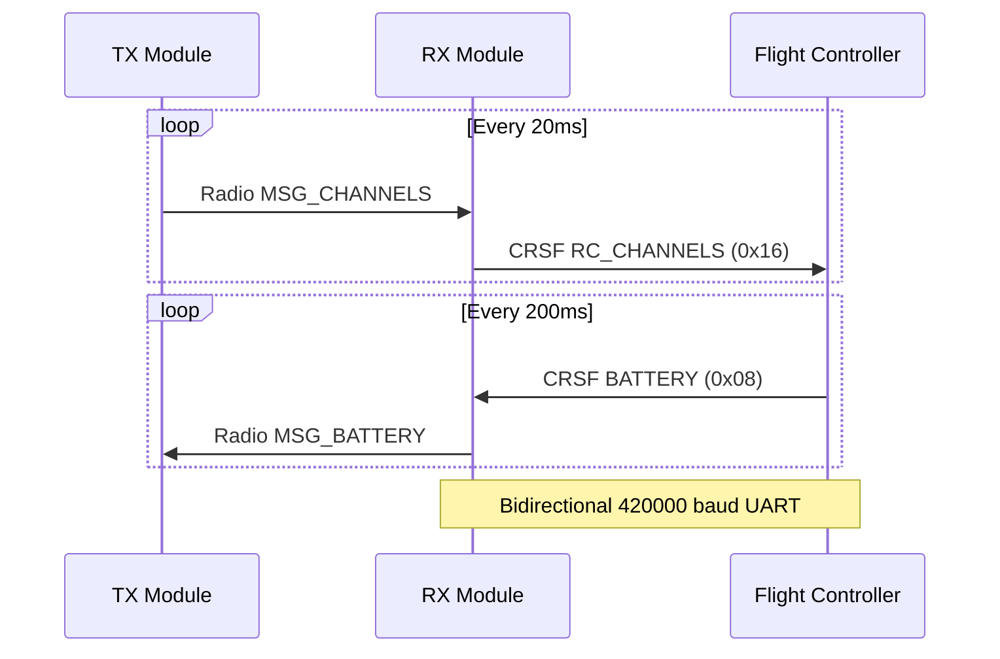

## Overview

The Crossfire (CRSF) protocol is used for communication between the RX module and the flight controller. It provides bidirectional communication at 420000 baud for sending RC channel data to the flight controller and receiving telemetry (battery, GPS, link statistics) back from the flight controller.

The XLRS RX module outputs CRSF on UART pins (GP8 TX, GP9 RX) compatible with Betaflight, ELRS, and other CRSF-enabled flight controllers.

## Protocol Configuration

| Parameter | Value | Description |
|-----------|-------|-------------|
| Baud Rate | 420000 | CRSF standard baud rate |
| Channels | 16 | Total channels supported (8 active + 8 centered) |
| Update Rate | 50Hz | RC channels frame rate (20ms) |
| Channel Range | 172-1811 | CRSF internal units (987µs - 2012µs) |
| Sync Byte | 0xC8 | Frame synchronization (CRSF_ADDRESS_FLIGHT_CONTROLLER) |
| Max Packet | 64 bytes | Maximum CRSF packet size |

## Frame Format

All CRSF frames follow this structure:

```
┌─────────┬──────────┬──────┬─────────────┬──────┐
│ ADDRESS │  LENGTH  │ TYPE │   PAYLOAD   │ CRC8 │
│ 1 byte  │  1 byte  │ 1 B  │   N bytes   │ 1 B  │
└─────────┴──────────┴──────┴─────────────┴──────┘
```

<ResponseField name="ADDRESS" type="uint8_t" required>
  Destination address from `crsf_addr_e` enumeration
</ResponseField>

<ResponseField name="LENGTH" type="uint8_t" required>
  Frame length (counts bytes after this field: TYPE + PAYLOAD + CRC)
</ResponseField>

<ResponseField name="TYPE" type="crsf_frame_type_e" required>
  Frame type identifier
</ResponseField>

<ResponseField name="PAYLOAD" type="uint8_t[]">
  Frame-specific payload data
</ResponseField>

<ResponseField name="CRC8" type="uint8_t" required>
  CRC8 checksum of TYPE + PAYLOAD
</ResponseField>

## CRSF Addresses

| Address | Value | Description |
|---------|-------|-------------|
| CRSF_ADDRESS_BROADCAST | 0x00 | Broadcast to all devices |
| CRSF_ADDRESS_USB | 0x10 | USB connection |
| CRSF_ADDRESS_FLIGHT_CONTROLLER | 0xC8 | Flight controller (default) |
| CRSF_ADDRESS_RADIO_TRANSMITTER | 0xEA | Radio transmitter |
| CRSF_ADDRESS_CRSF_RECEIVER | 0xEC | CRSF receiver |
| CRSF_ADDRESS_CRSF_TRANSMITTER | 0xEE | CRSF transmitter |
| CRSF_ADDRESS_GPS | 0xC2 | GPS module |
| CRSF_ADDRESS_CURRENT_SENSOR | 0xC0 | Current sensor |

## Frame Types

### RC Channels

<ResponseField name="CRSF_FRAMETYPE_RC_CHANNELS_PACKED" type="0x16">
  RC channel data frame sent from RX to flight controller. Contains 16 channels packed into 22 bytes using 11 bits per channel.
  
  **Direction:** RX → Flight Controller  
  **Frequency:** 50Hz (20ms intervals)  
  **Payload Size:** 22 bytes
  
  <Expandable title="Payload Structure">
    The 16 channels are bit-packed, with each channel using 11 bits:
    
    <ResponseField name="ch0-ch15" type="11-bit unsigned">
      16 channels packed into 22 bytes (176 bits total)
      - Internal range: 172-1811 CRSF units
      - Maps to: 987µs - 2012µs
      - Center value: 992 (1500µs)
    </ResponseField>
  </Expandable>
  
  **Channel Packing:**
  ```cpp
  struct crsf_channels_s {
      unsigned ch0 : 11;
      unsigned ch1 : 11;
      unsigned ch2 : 11;
      unsigned ch3 : 11;
      unsigned ch4 : 11;
      unsigned ch5 : 11;
      unsigned ch6 : 11;
      unsigned ch7 : 11;
      unsigned ch8 : 11;
      unsigned ch9 : 11;
      unsigned ch10 : 11;
      unsigned ch11 : 11;
      unsigned ch12 : 11;
      unsigned ch13 : 11;
      unsigned ch14 : 11;
      unsigned ch15 : 11;
  } __attribute__((packed));
  ```
  
  **Frame Example:**
  ```
  0xC8 0x18 0x16 [22 bytes channel data] [CRC8]
  └─┬─┘ └─┬─┘ └┬┘
    │     │    └─ Type: RC Channels (0x16)
    │     └────── Length: 24 (22 payload + 1 type + 1 crc)
    └──────────── Address: Flight Controller (0xC8)
  ```
</ResponseField>

### Telemetry Frames

<ResponseField name="CRSF_FRAMETYPE_BATTERY_SENSOR" type="0x08">
  Battery telemetry from flight controller to RX. Contains voltage, current, capacity, and remaining percentage.
  
  **Direction:** Flight Controller → RX  
  **Frequency:** ~5Hz (200ms intervals)  
  **Payload Size:** 8 bytes
  
  <Expandable title="Payload Structure">
    <ResponseField name="voltage" type="uint16_t">
      Battery voltage in 0.1V units (big-endian)
      - Example: 0x0067 (103) = 10.3V
      - Formula: voltage_V = value / 10.0
    </ResponseField>
    
    <ResponseField name="current" type="uint16_t">
      Battery current in 0.1A units (big-endian)
      - Example: 0x00C8 (200) = 20.0A
      - Formula: current_A = value / 10.0
    </ResponseField>
    
    <ResponseField name="capacity" type="uint24_t">
      Capacity used in mAh (big-endian, 3 bytes)
      - Example: 0x0003E8 = 1000 mAh
    </ResponseField>
    
    <ResponseField name="remaining" type="uint8_t">
      Battery remaining percentage (0-100%)
    </ResponseField>
  </Expandable>
  
  **Data Structure:**
  ```cpp
  struct crsf_sensor_battery_s {
      uint32_t voltage : 16;  // V * 10 big endian
      uint32_t current : 16;  // A * 10 big endian
      uint32_t capacity : 24; // mAh big endian
      uint32_t remaining : 8; // %
  } __attribute__((packed));
  ```
</ResponseField>

<ResponseField name="CRSF_FRAMETYPE_GPS" type="0x02">
  GPS telemetry from flight controller. Contains position, speed, heading, and satellite count.
  
  **Direction:** Flight Controller → RX  
  **Payload Size:** 15 bytes
  
  <Expandable title="Payload Structure">
    <ResponseField name="latitude" type="int32_t">
      Latitude in degrees / 10,000,000 (big-endian)
      - Example: 404211200 = 40.42112°
    </ResponseField>
    
    <ResponseField name="longitude" type="int32_t">
      Longitude in degrees / 10,000,000 (big-endian)
      - Example: -799454000 = -79.9454°
    </ResponseField>
    
    <ResponseField name="groundspeed" type="uint16_t">
      Ground speed in km/h / 10 (big-endian)
      - Example: 255 = 25.5 km/h
    </ResponseField>
    
    <ResponseField name="heading" type="uint16_t">
      GPS heading in degrees / 100 (big-endian)
      - Example: 18000 = 180.00°
    </ResponseField>
    
    <ResponseField name="altitude" type="uint16_t">
      Altitude in meters + 1000m offset (big-endian)
      - Example: 1250 = 250m altitude
    </ResponseField>
    
    <ResponseField name="satellites" type="uint8_t">
      Number of GPS satellites
    </ResponseField>
  </Expandable>
</ResponseField>

<ResponseField name="CRSF_FRAMETYPE_LINK_STATISTICS" type="0x14">
  Link quality statistics from receiver. Contains RSSI, SNR, and link quality metrics.
  
  **Direction:** RX → Flight Controller  
  **Payload Size:** 10 bytes
  
  <Expandable title="Payload Structure">
    <ResponseField name="uplink_RSSI_1" type="uint8_t">
      Uplink RSSI for antenna 1 (dBm + 130)
    </ResponseField>
    
    <ResponseField name="uplink_RSSI_2" type="uint8_t">
      Uplink RSSI for antenna 2 (dBm + 130)
    </ResponseField>
    
    <ResponseField name="uplink_Link_quality" type="uint8_t">
      Uplink link quality percentage (0-100)
    </ResponseField>
    
    <ResponseField name="uplink_SNR" type="int8_t">
      Uplink signal-to-noise ratio in dB
    </ResponseField>
    
    <ResponseField name="active_antenna" type="uint8_t">
      Currently active antenna (0 or 1)
    </ResponseField>
    
    <ResponseField name="rf_Mode" type="uint8_t">
      Current RF mode/rate index
    </ResponseField>
    
    <ResponseField name="uplink_TX_Power" type="uint8_t">
      Uplink transmit power index
    </ResponseField>
    
    <ResponseField name="downlink_RSSI" type="uint8_t">
      Downlink RSSI (dBm + 130)
    </ResponseField>
    
    <ResponseField name="downlink_Link_quality" type="uint8_t">
      Downlink link quality percentage (0-100)
    </ResponseField>
    
    <ResponseField name="downlink_SNR" type="int8_t">
      Downlink signal-to-noise ratio in dB
    </ResponseField>
  </Expandable>
</ResponseField>

### Extended Frames

<ResponseField name="CRSF_FRAMETYPE_DEVICE_PING" type="0x28">
  Device discovery ping (extended header frame)
</ResponseField>

<ResponseField name="CRSF_FRAMETYPE_DEVICE_INFO" type="0x29">
  Device information response (extended header frame)
</ResponseField>

<ResponseField name="CRSF_FRAMETYPE_PARAMETER_SETTINGS_ENTRY" type="0x2B">
  Parameter settings entry for configuration
</ResponseField>

<ResponseField name="CRSF_FRAMETYPE_PARAMETER_READ" type="0x2C">
  Parameter read request
</ResponseField>

<ResponseField name="CRSF_FRAMETYPE_PARAMETER_WRITE" type="0x2D">
  Parameter write command
</ResponseField>

<ResponseField name="CRSF_FRAMETYPE_COMMAND" type="0x32">
  Device command
</ResponseField>

### Other Frames

<ResponseField name="CRSF_FRAMETYPE_ATTITUDE" type="0x1E">
  Attitude telemetry (roll, pitch, yaw)
  
  **Payload Size:** 6 bytes
</ResponseField>

<ResponseField name="CRSF_FRAMETYPE_FLIGHT_MODE" type="0x21">
  Flight mode text string
</ResponseField>

<ResponseField name="CRSF_FRAMETYPE_MSP_REQ" type="0x7A">
  MSP request using MSP sequence
</ResponseField>

<ResponseField name="CRSF_FRAMETYPE_MSP_RESP" type="0x7B">
  MSP response with chunked binary data (58 bytes)
</ResponseField>

<ResponseField name="CRSF_FRAMETYPE_MSP_WRITE" type="0x7C">
  MSP write with chunked binary data (8 bytes)
</ResponseField>

## Channel Value Mapping

CRSF uses 11-bit channel values that must be converted to/from standard RC microsecond values:

| CRSF Value | Microseconds | Description |
|------------|--------------|-------------|
| 172 | 987µs | Minimum (with E.Limits) |
| 191 | 1000µs | Standard minimum |
| 992 | 1500µs | Center/neutral |
| 1792 | 2000µs | Standard maximum |
| 1811 | 2012µs | Maximum (with E.Limits) |

**Conversion Formulas:**

```cpp
// Microseconds to CRSF
int16_t usToCrsf(uint16_t us) {
    return ((us - 988) * 1639) / 1012 + 172;
}

// CRSF to Microseconds
uint16_t crsfToUs(int16_t crsf) {
    return ((crsf - 172) * 1012) / 1639 + 988;
}
```

## XLRS Implementation

The XLRS RX module implements CRSF output as follows:

### Transmitted Frames (RX → FC)

- **RC Channels (0x16):** 50Hz, 16 channels (8 from radio + 8 centered at 1500µs)
- **Link Statistics (0x14):** Optional, can be sent periodically

### Received Frames (FC → RX)

- **Battery Sensor (0x08):** Received and forwarded to TX via radio MSG_BATTERY
- **GPS (0x02):** Can be received and processed
- **Other telemetry:** Parsed but may not be forwarded

### Pin Configuration

| Signal | RX Pin | FC Pin | Description |
|--------|--------|--------|-------------|
| CRSF TX | GP8 | CRSF RX | RC channels to FC |
| CRSF RX | GP9 | CRSF TX | Telemetry from FC |
| GND | GND | GND | Common ground |

## Communication Flow



## CRC Calculation

CRSF uses CRC8-DVB-S2 polynomial (0xD5) for frame validation:

```cpp
uint8_t crc8_dvb_s2(uint8_t crc, uint8_t a) {
    crc ^= a;
    for (int i = 0; i < 8; i++) {
        if (crc & 0x80) {
            crc = (crc << 1) ^ 0xD5;
        } else {
            crc = crc << 1;
        }
    }
    return crc;
}
```

The CRC is calculated over the TYPE and PAYLOAD fields only.

<Note>
  The CRSF protocol is bidirectional, but the XLRS RX primarily sends RC channels to the flight controller and receives battery telemetry back. The telemetry is then forwarded to the TX module over radio.
</Note>

<Warning>
  CRSF channel values use 11-bit encoding (172-1811), not standard microseconds. Always convert between formats when interfacing with other systems.
</Warning>

## Compatibility

The XLRS CRSF implementation is compatible with:

- Betaflight (CRSF receiver mode)
- iNav
- ELRS-compatible flight controllers
- Any flight controller supporting CRSF protocol at 420000 baud

## Usage Example

### Sending RC Channels (RX Module)

```cpp
CRSF crsf(&Serial1, 8, 9);  // TX=GP8, RX=GP9
crsf.begin();

uint16_t channels[16];
// Populate first 8 channels from radio
channels[0] = 1500;  // Aileron
channels[1] = 1500;  // Elevator
channels[2] = 1500;  // Rudder
channels[3] = 1000;  // Throttle
// ... remaining channels centered at 1500

crsf.sendRCChannels(channels, 16);
```

### Receiving Battery Telemetry (RX Module)

```cpp
CrsfSerial crsf(Serial1, 420000);

void setup() {
    crsf.begin();
    crsf.onPacketBattery = [](float voltage, float current, uint32_t capacity, uint8_t remaining) {
        Serial.printf("Battery: %.1fV, %.1fA, %dmAh, %d%%\n", 
                      voltage, current, capacity, remaining);
        // Forward to TX via radio
        sendBatteryToTX(voltage, current, remaining);
    };
}

void loop() {
    crsf.loop();  // Process incoming CRSF frames
}
```