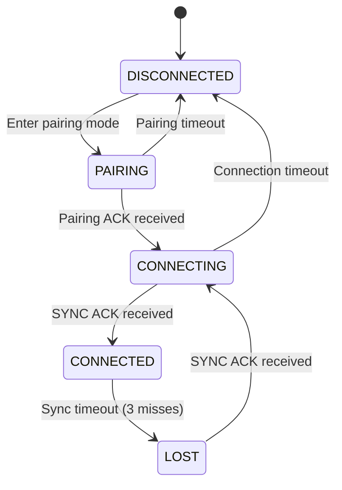

The `StatusData` structure is used to transmit connection status and packet statistics from the TX module to the RC board via UART protocol.

## Structure Definition

```cpp
struct StatusData {
    uint8_t connectionState;  // ConnectionState enum
    uint8_t pairingState;     // 0=unpaired, 1=paired
    uint32_t packetsReceived;
    uint32_t packetsLost;
} __attribute__((packed));
```

## Fields

<ResponseField name="connectionState" type="uint8_t">
  Current connection state of the radio link.
  
  Maps to the `ConnectionState` enum values:
  
  | Value | State | Description |
  |-------|-------|-------------|
  | 0 | DISCONNECTED | No connection, waiting for pairing |
  | 1 | PAIRING | Exchanging pairing packets |
  | 2 | CONNECTING | Paired, establishing SYNC handshake |
  | 3 | CONNECTED | Active link, transmitting data |
  | 4 | LOST | Connection timeout, attempting reconnect |
</ResponseField>

<ResponseField name="pairingState" type="uint8_t">
  Indicates whether the TX and RX are paired.
  
  - **0**: Unpaired (no pairing key stored)
  - **1**: Paired (pairing key and device IDs stored in EEPROM)
  
  A paired device will automatically attempt to reconnect on power-up.
</ResponseField>

<ResponseField name="packetsReceived" type="uint32_t">
  Total number of valid packets received from the RX module.
  
  This counter increments for each successfully decrypted and authenticated packet received via radio.
</ResponseField>

<ResponseField name="packetsLost" type="uint32_t">
  Total number of expected packets that were not received.
  
  Calculated based on sequence number gaps in received packets. High packet loss indicates poor signal quality or interference.
</ResponseField>

## Connection States

### DISCONNECTED (0)

Initial state when the system powers on and no pairing exists.

```cpp
// TX module behavior in DISCONNECTED state
if (connectionState == DISCONNECTED) {
    // Enter pairing mode automatically
    enterPairingMode();
}
```

### PAIRING (1)

Actively exchanging pairing packets with binding phrase verification.

```cpp
// TX module in PAIRING state
sendPairingPacket();  // Broadcasts binding UID
// Waits for PAIRING_ACK from RX
```

### CONNECTING (2)

Pairing complete, establishing connection via SYNC/SYNC_ACK handshake.

```cpp
// TX module in CONNECTING state
sendSyncPacket();  // Sends device ID and sequence number
// Waits for SYNC_ACK from RX
```

### CONNECTED (3)

Active link with data transmission.

```cpp
// TX module in CONNECTED state
sendChannelData();     // Transmits RC channels at ~50Hz
receiveTelemetry();    // Receives battery and status
```

### LOST (4)

Connection timeout detected, attempting to reconnect.

```cpp
// TX module in LOST state
syncAckMisses++;
if (syncAckMisses >= 3) {  // Hysteresis
    connectionState = LOST;
    // Attempt to re-establish SYNC
}
```

## Usage Example

### TX Module (Sending Status)

```cpp
#include "UARTProtocol.h"
#include "Protocol.h"

UARTProtocol uartProto(&Serial1);
Protocol protocol;

uint32_t lastStatusUpdate = 0;

void sendStatus() {
    StatusData status;
    status.connectionState = protocol.getConnectionState();
    status.pairingState = protocol.isPaired() ? 1 : 0;
    status.packetsReceived = protocol.getPacketsReceived();
    status.packetsLost = protocol.getPacketsLost();
    
    uartProto.sendStatus(&status);
}

void loop() {
    // Send status update every 500ms
    if (millis() - lastStatusUpdate >= 500) {
        sendStatus();
        lastStatusUpdate = millis();
    }
}
```

### RC Board (Receiving Status)

```cpp
#include "UARTProtocol.h"
#include <Adafruit_SH110X.h>

UARTProtocol uartProto(&Serial1);
Adafruit_SH1106G display(128, 64, &Wire);

const char* connectionStateStr[] = {
    "DISCONNECTED",
    "PAIRING",
    "CONNECTING",
    "CONNECTED",
    "LOST"
};

void onStatusReceived(const StatusData* data) {
    // Update display with connection status
    display.clearDisplay();
    display.setCursor(0, 0);
    
    // Connection state
    display.print("State: ");
    if (data->connectionState < 5) {
        display.println(connectionStateStr[data->connectionState]);
    } else {
        display.println("UNKNOWN");
    }
    
    // Pairing state
    display.print("Paired: ");
    display.println(data->pairingState ? "YES" : "NO");
    
    // Packet statistics
    display.print("RX: ");
    display.println(data->packetsReceived);
    
    display.print("Lost: ");
    display.println(data->packetsLost);
    
    // Packet loss rate
    if (data->packetsReceived > 0) {
        float lossRate = (data->packetsLost * 100.0) / 
                         (data->packetsReceived + data->packetsLost);
        display.print("Loss: ");
        display.print(lossRate, 1);
        display.println("%");
    }
    
    display.display();
}

void setup() {
    uartProto.begin(420000);
    uartProto.setOnStatus(onStatusReceived);
    display.begin();
}

void loop() {
    uartProto.loop();
}
```

## UART Transmission

The `StatusData` structure is transmitted via UART protocol using message type `UART_MSG_STATUS` (0x21):

- **Frame format**: SYNC (0xA5) + LENGTH (10) + TYPE (0x21) + PAYLOAD (10 bytes) + CRC8
- **Payload size**: 10 bytes (1 + 1 + 4 + 4)
- **Update rate**: Typically 2Hz (500ms intervals)
- **Direction**: TX module → RC board

## Status Request

The RC board can request a status update at any time:

```cpp
// RC board requests status
uartProto.sendCommand(UART_MSG_CMD_STATUS_REQ);

// TX module responds with status
// onStatusReceived() callback will be triggered
```

## Packet Loss Calculation

Packet loss is calculated based on sequence number gaps:

```cpp
uint32_t calculatePacketLoss(uint16_t currentSeq, uint16_t lastSeq) {
    if (currentSeq > lastSeq) {
        return currentSeq - lastSeq - 1;  // Gap in sequence
    } else {
        // Sequence number wrapped around
        return (0xFFFF - lastSeq) + currentSeq;
    }
}
```

Example:
- Last sequence: 100
- Current sequence: 105
- Packets lost: 105 - 100 - 1 = 4 packets

## Connection State Transitions



## Monitoring Tips

### Good Connection Indicators

- **connectionState**: CONNECTED (3)
- **pairingState**: 1 (paired)
- **Packet loss rate**: Less than 5%

### Warning Signs

- **connectionState**: LOST (4) or frequently changing
- **Packet loss rate**: Greater than 10%
- High `packetsLost` counter increment rate

### Critical Issues

- **connectionState**: DISCONNECTED (0) during flight
- **pairingState**: 0 (unpaired) when expecting connection
- **Packet loss rate**: Greater than 50%

## See Also

- [UART Protocol](/api/uart-protocol) - Protocol for UART transmission
- [UART Messages](/api/uart-messages) - UART message types
- [TelemetryData](/api/telemetry) - Link quality and battery telemetry
- [Protocol](/api/protocol) - Connection state management
