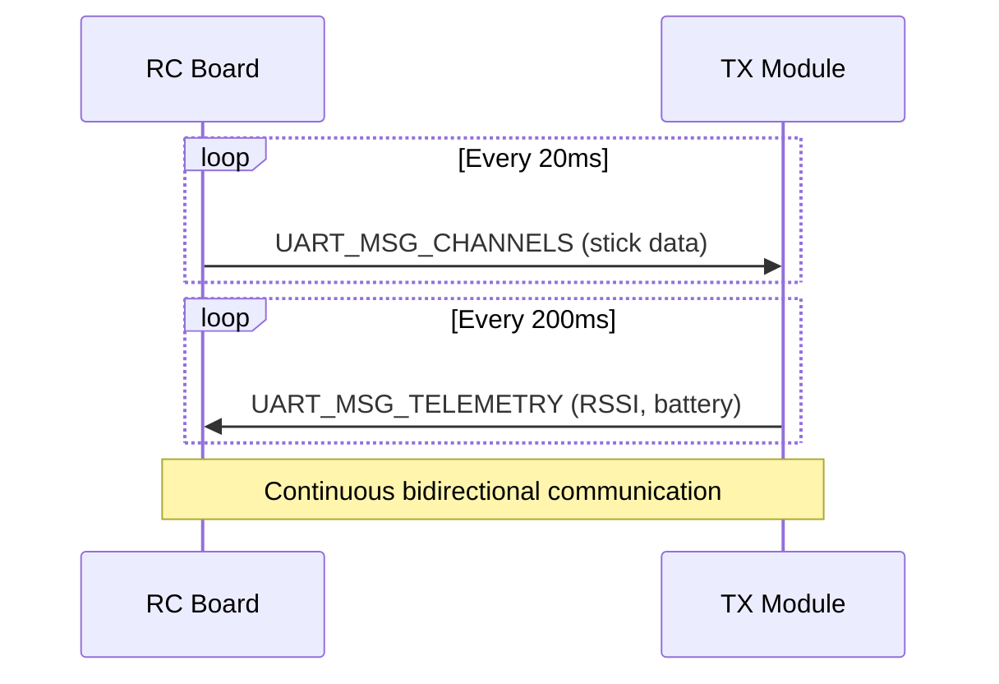
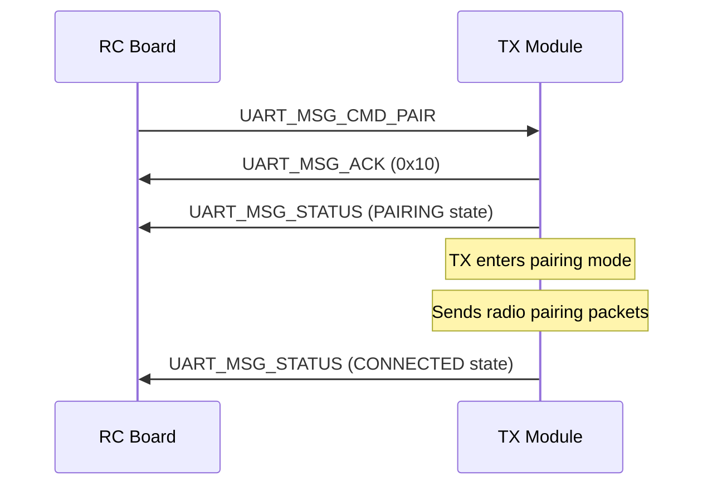

## Overview

The UART protocol provides high-speed communication between the RC board and TX module at 420000 baud. It uses a frame-based protocol with CRC8 checksums for reliable data transfer. The protocol supports bidirectional communication for sending channel data, receiving telemetry, and exchanging commands.

## Protocol Configuration

| Parameter | Value | Description |
|-----------|-------|-------------|
| Baud Rate | 420000 | High-speed UART for low latency |
| Data Bits | 8 | Standard byte transmission |
| Stop Bits | 1 | Standard stop bit |
| Parity | None | CRC8 used for error detection |
| Sync Byte | 0xA5 | Frame synchronization marker |
| Max Payload | 60 bytes | Maximum payload size per frame |
| Max Frame Size | 64 bytes | SYNC + LEN + TYPE + PAYLOAD + CRC |

## Frame Format

All UART messages follow this structure:

```
┌──────┬────────┬──────┬─────────────┬──────┐
│ SYNC │ LENGTH │ TYPE │   PAYLOAD   │ CRC8 │
│ 0xA5 │ 1 byte │ 1 B  │  0-60 bytes │ 1 B  │
└──────┴────────┴──────┴─────────────┴──────┘
```

<ResponseField name="SYNC" type="0xA5" required>
  Frame synchronization byte (constant)
</ResponseField>

<ResponseField name="LENGTH" type="uint8_t" required>
  Payload length (0-60 bytes)
</ResponseField>

<ResponseField name="TYPE" type="UARTMsgType" required>
  Message type from the UARTMsgType enumeration
</ResponseField>

<ResponseField name="PAYLOAD" type="uint8_t[]">
  Message-specific payload data (0-60 bytes)
</ResponseField>

<ResponseField name="CRC8" type="uint8_t" required>
  CRC8 checksum of LENGTH + TYPE + PAYLOAD
</ResponseField>

## Message Types

### Data Messages

<ResponseField name="UART_MSG_CHANNELS" type="0x01">
  Channel data from RC board to TX module. Contains stick positions and switch states.
  
  **Direction:** RC Board → TX Module  
  **Frequency:** ~50Hz (20ms intervals)  
  **Payload:** 16 bytes
  
  <Expandable title="Payload Structure">
    <ResponseField name="channels" type="uint16_t[8]">
      8 channels, each 2 bytes (16-bit unsigned)
      - Range: 1000-2000 µs
      - Ch0: Aileron
      - Ch1: Elevator
      - Ch2: Rudder
      - Ch3: Throttle
      - Ch4-7: Aux switches
    </ResponseField>
  </Expandable>
  
  **Example Packet:**
  ```
  0xA5 0x10 0x01 [16 bytes channel data] [CRC8]
  ```
</ResponseField>

<ResponseField name="UART_MSG_TELEMETRY" type="0x20">
  Telemetry data from TX module to RC board. Contains signal strength, battery info, and link quality.
  
  **Direction:** TX Module → RC Board  
  **Frequency:** ~5Hz (200ms intervals)  
  **Payload:** 11 bytes
  
  <Expandable title="Payload Structure">
    <ResponseField name="rssi" type="int16_t">
      Received signal strength in dBm (2 bytes)
      - Typical range: -120 to -30 dBm
      - Good connection: > -90 dBm
    </ResponseField>
    
    <ResponseField name="snr" type="float">
      Signal-to-noise ratio in dB (4 bytes)
      - Higher is better
      - Typical: 5-15 dB
    </ResponseField>
    
    <ResponseField name="rxBattMv" type="uint16_t">
      RX battery voltage in millivolts (2 bytes)
      - Example: 16600 = 16.6V
    </ResponseField>
    
    <ResponseField name="rxBattPct" type="uint8_t">
      RX battery percentage (1 byte, 0-100%)
    </ResponseField>
    
    <ResponseField name="linkQuality" type="uint8_t">
      Link quality percentage (1 byte, 0-100%)
      - Calculated from RSSI
      - 100% = excellent, 0% = no link
    </ResponseField>
  </Expandable>
</ResponseField>

<ResponseField name="UART_MSG_STATUS" type="0x21">
  Status information from TX module to RC board. Contains connection state and packet statistics.
  
  **Direction:** TX Module → RC Board  
  **Frequency:** On change or when requested  
  **Payload:** 10 bytes
  
  <Expandable title="Payload Structure">
    <ResponseField name="connectionState" type="uint8_t">
      Current connection state enumeration:
      - 0: DISCONNECTED
      - 1: PAIRING
      - 2: CONNECTING
      - 3: CONNECTED
      - 4: LOST
    </ResponseField>
    
    <ResponseField name="pairingState" type="uint8_t">
      Pairing status:
      - 0: Unpaired
      - 1: Paired
    </ResponseField>
    
    <ResponseField name="packetsReceived" type="uint32_t">
      Total packets received (4 bytes)
    </ResponseField>
    
    <ResponseField name="packetsLost" type="uint32_t">
      Total packets lost (4 bytes)
    </ResponseField>
  </Expandable>
</ResponseField>

### Command Messages

<ResponseField name="UART_MSG_CMD_PAIR" type="0x10">
  Command to enter pairing mode. Sent from RC board to TX module.
  
  **Direction:** RC Board → TX Module  
  **Payload:** 0 bytes  
  **Response:** UART_MSG_ACK on success
  
  Initiates pairing mode on the TX module, which will send MSG_PAIRING packets over radio to pair with an RX in pairing mode.
</ResponseField>

<ResponseField name="UART_MSG_CMD_BOND" type="0x11">
  Command to check bonding status. Sent from RC board to TX module.
  
  **Direction:** RC Board → TX Module  
  **Payload:** 0 bytes  
  **Response:** UART_MSG_STATUS with pairing state
  
  Requests the current pairing/bonding status from the TX module.
</ResponseField>

<ResponseField name="UART_MSG_CMD_RESTART" type="0x12">
  Command to restart the TX module. Sent from RC board to TX module.
  
  **Direction:** RC Board → TX Module  
  **Payload:** 0 bytes  
  **Response:** None (module restarts)
  
  Triggers a software reset of the TX module.
</ResponseField>

<ResponseField name="UART_MSG_CMD_STATUS_REQ" type="0x13">
  Request status update from TX module. Sent from RC board.
  
  **Direction:** RC Board → TX Module  
  **Payload:** 0 bytes  
  **Response:** UART_MSG_STATUS
  
  Requests an immediate status update containing connection state and statistics.
</ResponseField>

<ResponseField name="UART_MSG_PING" type="0x14">
  Device availability check. Can be sent by either device.
  
  **Direction:** Bidirectional  
  **Payload:** 0 bytes  
  **Response:** UART_MSG_PONG
  
  Used to verify that the other device is alive and responsive.
</ResponseField>

<ResponseField name="UART_MSG_PONG" type="0x15">
  Device availability response. Sent in response to UART_MSG_PING.
  
  **Direction:** Bidirectional  
  **Payload:** 0 bytes  
  **Response to:** UART_MSG_PING
  
  Confirms that the device is operational and ready to communicate.
</ResponseField>

### Response Messages

<ResponseField name="UART_MSG_ACK" type="0x22">
  Acknowledgment of successful command execution.
  
  **Direction:** TX Module → RC Board  
  **Payload:** 1 byte
  
  <Expandable title="Payload Structure">
    <ResponseField name="ackedCommand" type="UARTMsgType">
      The command message type that was successfully executed
    </ResponseField>
  </Expandable>
  
  **Example:** ACK for pairing command
  ```
  0xA5 0x01 0x22 0x10 [CRC8]
  ```
</ResponseField>

<ResponseField name="UART_MSG_ERROR" type="0x23">
  Error response indicating command failure.
  
  **Direction:** TX Module → RC Board  
  **Payload:** 1 byte
  
  <Expandable title="Payload Structure">
    <ResponseField name="errorCode" type="uint8_t">
      Error code indicating failure reason:
      - 0x01: Invalid command
      - 0x02: Command timeout
      - 0x03: Pairing failed
      - 0x04: Not paired
      - 0x05: Radio error
      - 0xFF: Unknown error
    </ResponseField>
  </Expandable>
</ResponseField>

## Data Structures

The UART protocol uses packed C structures for data serialization:

### ChannelData

```cpp
struct ChannelData {
    uint16_t channels[8];  // 1000-2000µs
} __attribute__((packed));
```

### TelemetryData

```cpp
struct TelemetryData {
    int16_t rssi;          // dBm
    float snr;             // dB
    uint16_t rxBattMv;     // millivolts
    uint8_t rxBattPct;     // percentage (0-100)
    uint8_t linkQuality;   // 0-100%
} __attribute__((packed));
```

### StatusData

```cpp
struct StatusData {
    uint8_t connectionState;  // ConnectionState enum
    uint8_t pairingState;     // 0=unpaired, 1=paired
    uint32_t packetsReceived;
    uint32_t packetsLost;
} __attribute__((packed));
```

## Communication Flow

### Normal Operation



### Pairing Sequence



## Error Handling

<CardGroup cols={2}>
  <Card title="CRC Validation" icon="check">
    All frames include CRC8 checksum. Invalid frames are silently dropped.
  </Card>
  
  <Card title="Timeout Detection" icon="clock">
    RX state machine has 100ms timeout. Incomplete frames are discarded.
  </Card>
  
  <Card title="Frame Synchronization" icon="sync">
    State machine searches for SYNC byte (0xA5) to recover from errors.
  </Card>
  
  <Card title="Statistics Tracking" icon="chart-line">
    Counters track sent, received, and dropped packets for diagnostics.
  </Card>
</CardGroup>

## Implementation Notes

<Note>
  The UART protocol uses a non-blocking state machine for reception. The `loop()` method must be called regularly to process incoming bytes.
</Note>

<Warning>
  The maximum payload size is 60 bytes. Attempting to send larger payloads will fail. The maximum total frame size is 64 bytes including overhead.
</Warning>

## Usage Example

### Sending Channels (RC Board)

```cpp
UARTProtocol uart(&Serial1);
uart.begin(420000);

uint16_t channels[8] = {1500, 1500, 1500, 1000, 2000, 1000, 1500, 1500};
uart.sendChannels(channels);
```

### Receiving Telemetry (RC Board)

```cpp
void onTelemetry(const TelemetryData* data) {
    Serial.printf("RSSI: %d dBm, SNR: %.1f dB\n", data->rssi, data->snr);
    Serial.printf("RX Battery: %d mV (%d%%)\n", data->rxBattMv, data->rxBattPct);
    Serial.printf("Link Quality: %d%%\n", data->linkQuality);
}

uart.setOnTelemetry(onTelemetry);
uart.loop();  // Call in main loop
```

### Initiating Pairing (RC Board)

```cpp
uart.sendCommand(UART_MSG_CMD_PAIR);
```