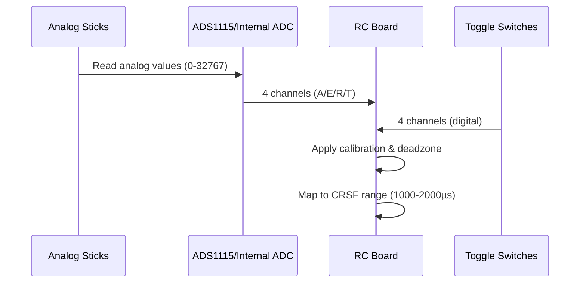
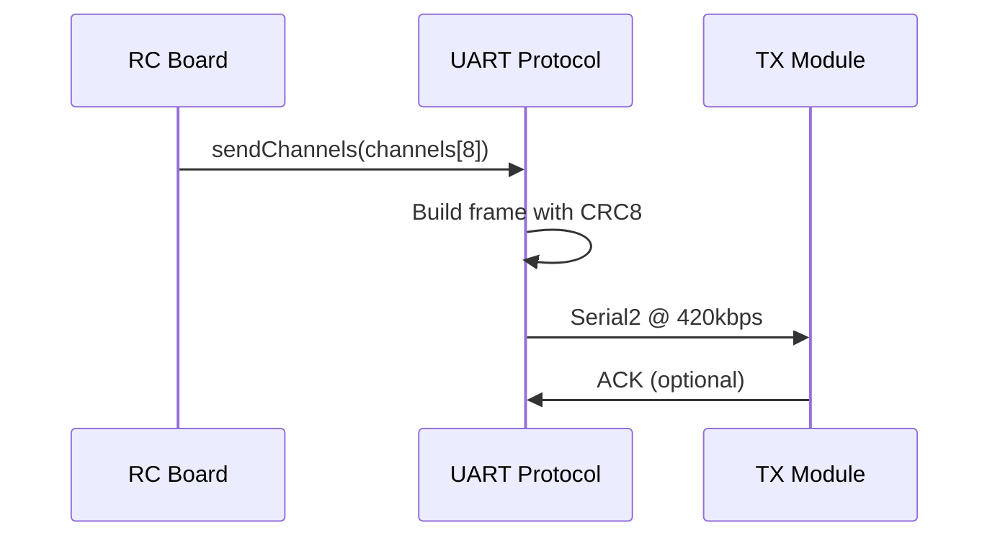
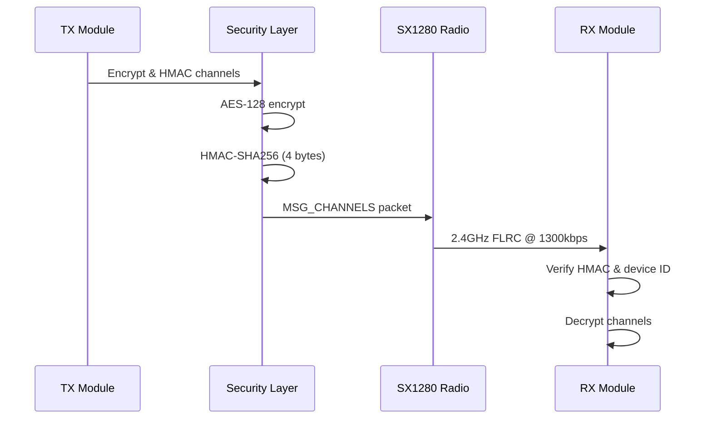
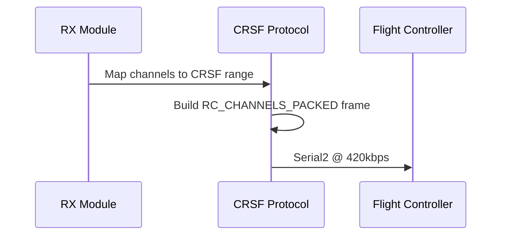
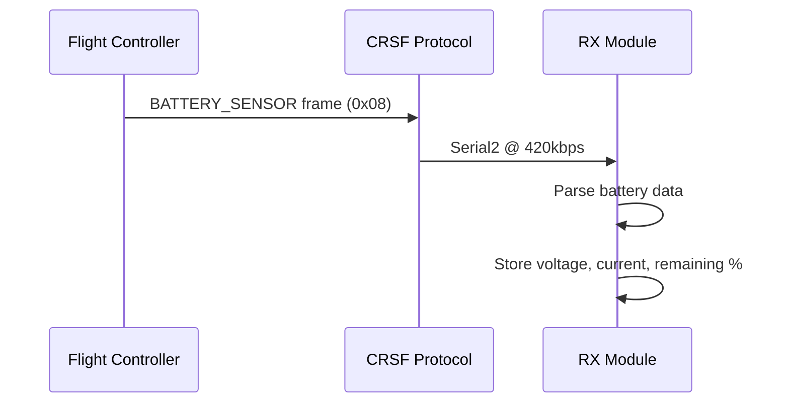
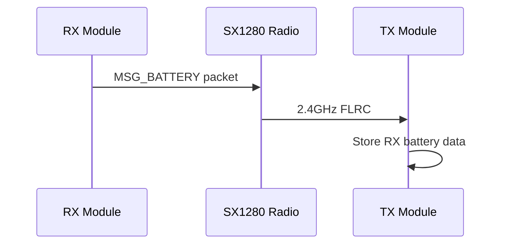
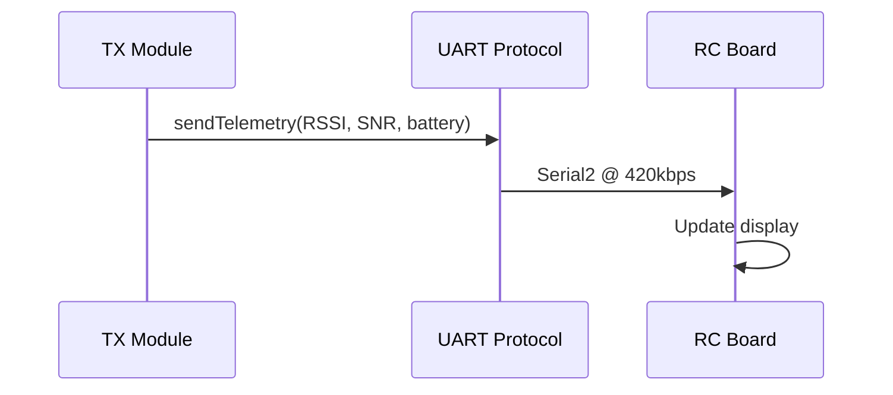
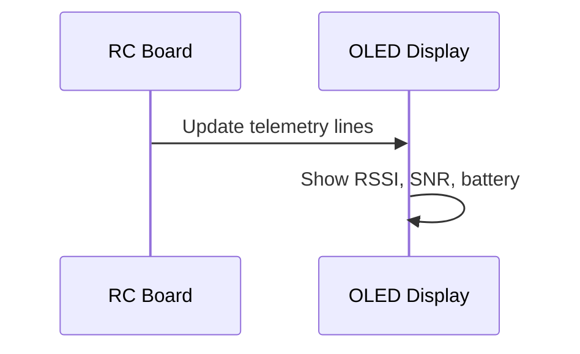
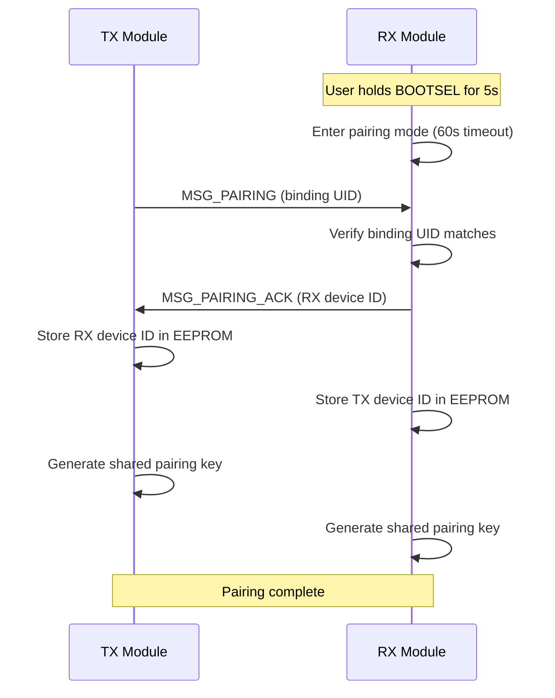
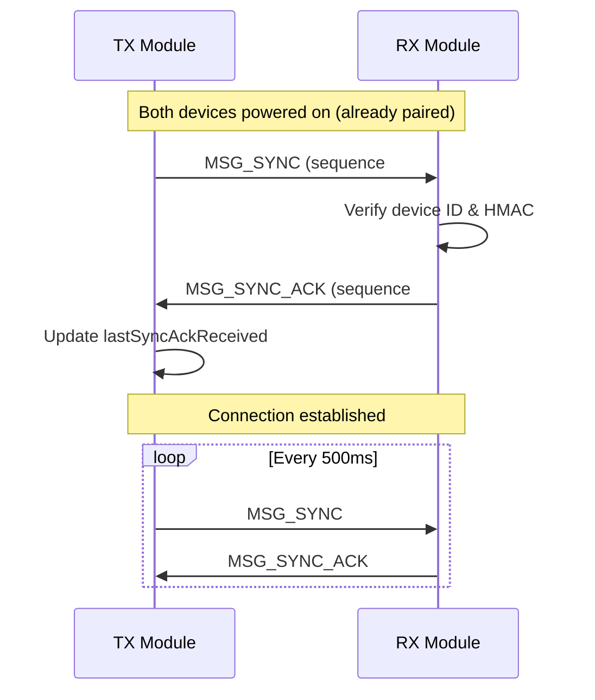

## Overview

XLRS implements a complete bidirectional communication flow:
- **Forward path**: RC inputs → TX → RX → Flight Controller
- **Reverse path**: FC telemetry → RX → TX → RC display

## Forward Path: Control Data

### Step 1: RC Board Input Reading

The RC board reads inputs at **250Hz** (4ms intervals):

1. **Analog sticks** (4 channels):
   - Read via ADS1115 I2C ADC (16-bit) or RP2350 internal ADC (12-bit)
   - Apply calibration (min/max/center from EEPROM)
   - Apply 5% deadzone to center stick readings
   - Map to CRSF channel range (1000-2000µs)
   - Channel mapping:
     - Ch0: Aileron (Stick1 Y, inverted)
     - Ch1: Elevator (Stick1 X)
     - Ch2: Throttle (Stick2 X)
     - Ch3: Rudder (Stick2 Y, inverted)

2. **Toggle switches** (4 channels):
   - Read via dual GPIO pins (INPUT_PULLUP)
   - Logic: IN1 high = 1000µs, IN2 high = 2000µs, both low = 1500µs
   - Channels 4-7 (Aux1-Aux4)

**Source**: `src/rc_crsf_main.cpp:335-439` (`readInputs()`)

### Step 2: UART Transmission (RC → TX)

UART protocol frame structure:
- **Header**: `0x55` (sync byte)
- **Type**: `UART_MSG_CHANNELS` (0x01)
- **Length**: 16 bytes (8 channels × 2 bytes)
- **Payload**: Channel values (16-bit big-endian)
- **CRC8**: Checksum over type + length + payload

**Baudrate**: 420kbps  
**Update rate**: 250Hz (4ms intervals)  
**Pins**: TX=GP8, RX=GP9

**Source**: `include/UARTProtocol.h`, `src/rc_crsf_main.cpp:444-449`

### Step 3: Radio Transmission (TX → RX)

**MSG_CHANNELS frame format** (31 bytes encrypted + 2 bytes overhead = 33 bytes total):
- **Type**: 0x01 (1 byte)
- **Device ID**: TX device ID (8 bytes)
- **Channel data**: 8 channels × 2 bytes (16 bytes, big-endian)
- **Sequence number**: 2 bytes
- **HMAC**: Truncated HMAC-SHA256 (4 bytes)

Security features:
- **AES-128 encryption** using shared pairing key
- **HMAC-SHA256 authentication** (truncated to 4 bytes)
- **Sequence number** for replay attack protection
- **Device ID validation** (only accept from paired TX)

**Radio configuration**:
- Frequency: 2420 MHz
- Modulation: FLRC
- Bitrate: 1300 kbps
- Output power: 10 dBm
- Update rate: ~50Hz (20ms intervals)

**Source**: `src/tx_main_sx128x.cpp:231-234`, `include/Protocol.h`

### Step 4: CRSF Output (RX → FC)

The RX module outputs CRSF frames at **50Hz** (20ms intervals):

1. **Map channel values**:
   - Input: 1000-2000µs (from radio)
   - Output: CRSF 11-bit packed format (172-1811)
   - 16 channels total (8 active + 8 centered at 992)

2. **CRSF frame structure**:
   - **Address**: `CRSF_ADDRESS_FLIGHT_CONTROLLER` (0xC8)
   - **Type**: `CRSF_FRAMETYPE_RC_CHANNELS_PACKED` (0x16)
   - **Payload**: 22 bytes (16 channels × 11 bits, packed)
   - **CRC8**: Checksum over type + payload

**Pins**: TX=GP8 (to FC RX), RX=GP9 (from FC TX for telemetry)  
**Baudrate**: 420kbps

**Source**: `src/rx_main_sx128x.cpp:389-437`

## Reverse Path: Telemetry

### Step 1: Battery Telemetry (FC → RX)

The RX module receives battery telemetry from the flight controller:

- **Frame type**: `CRSF_FRAMETYPE_BATTERY_SENSOR` (0x08)
- **Data**:
  - Battery voltage (V × 10, 16-bit)
  - Battery current (A × 10, 16-bit)
  - Battery capacity (mAh, 24-bit)
  - Battery remaining (%, 8-bit)

**Source**: `src/rx_main_sx128x.cpp:101-120` (`onBatteryTelemetry()`)

### Step 2: Radio Telemetry (RX → TX)

**MSG_BATTERY frame format** (5 bytes payload):
- **Type**: 0x02 (1 byte)
- **Voltage**: V × 10 (2 bytes, big-endian)
- **Current**: A × 10 (2 bytes, big-endian)
- **Remaining**: Battery % (1 byte)

**Update rate**: 5Hz (200ms intervals)

**Source**: `src/rx_main_sx128x.cpp:383-386`, `src/tx_main_sx128x.cpp:248-267`

### Step 3: UART Telemetry (TX → RC)

The TX module sends telemetry to the RC board at **5Hz** (200ms intervals):

**Telemetry data**:
- **RSSI**: Received signal strength (dBm, int16_t)
- **SNR**: Signal-to-noise ratio (dB, float)
- **RX Battery**: Voltage (mV, uint16_t) and percentage (uint8_t)
- **Link Quality**: 0-100% (calculated from RSSI)

**UART protocol frame**:
- **Type**: `UART_MSG_TELEMETRY` (0x02)
- **Payload**: 12 bytes (RSSI, SNR, battery data, link quality)

**Source**: `src/tx_main_sx128x.cpp:398-426`, `src/rc_crsf_main.cpp:466-472`

### Step 4: Display Update (RC Board)

The RC board displays telemetry on the OLED at **5Hz** (200ms intervals):

**Display layout**:
- **Line 1**: RC-CRSF, TX battery voltage & percent
- **Line 2**: Charging status and VBUS status
- **Line 3**: TX connection state and RSSI
- **Line 4**: RX battery voltage, percent, and SNR

**Source**: `src/rc_crsf_main.cpp:568-638` (`updateDisplay()`)

## Connection Management

### Pairing Process

**Pairing steps**:
1. RX enters pairing mode (BOOTSEL button or auto-timeout)
2. TX sends `MSG_PAIRING` with binding UID
3. RX verifies binding UID matches (from binding phrase)
4. RX sends `MSG_PAIRING_ACK` with device ID
5. Both devices store paired device IDs in EEPROM
6. Both devices generate shared encryption key

**Source**: `src/pairing.cpp`, `README.md:87-117`

### Connection Handshake

**SYNC/SYNC_ACK handshake**:
- Maintains connection state
- Periodic sync packets (500ms intervals)
- Hysteresis: requires 3 missed SYNC_ACKs before marking connection as lost
- Prevents false disconnects from half-duplex timing collisions

**Source**: `src/tx_main_sx128x.cpp:212-226`, `src/rx_main_sx128x.cpp:332-356`

## Timing and Performance

| Component | Update Rate | Latency Contribution |
|-----------|-------------|----------------------|
| RC Board input reading | 250Hz (4ms) | 4ms |
| RC to TX UART | 250Hz (4ms) | less than 1ms |
| TX to RX Radio | approximately 50Hz (20ms) | 20ms |
| RX to FC CRSF | 50Hz (20ms) | less than 1ms |
| **Total end-to-end** | **approximately 50Hz** | **approximately 25ms** |

Telemetry (reverse path):
- Battery telemetry: 5Hz (200ms intervals)
- Link quality: 5Hz (200ms intervals)
- Display update: 5Hz (200ms intervals)

## Next Steps

<CardGroup cols={2}>
  <Card title="Component Details" icon="microchip" href="/architecture/components">
    Detailed breakdown of each component's implementation
  </Card>
  <Card title="System Overview" icon="sitemap" href="/architecture/overview">
    High-level architecture and key features
  </Card>
</CardGroup>
