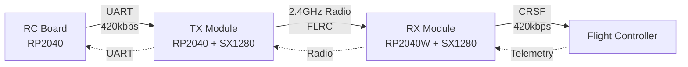

## Overview

XLRS uses a split architecture consisting of three independent components that communicate over UART and 2.4GHz radio to provide a complete remote control system for FPV drones.

<CardGroup cols={3}>
  <Card title="RC Board" icon="gamepad">
    Reads analog inputs (joysticks, switches) and sends channel data to TX module via UART
  </Card>
  <Card title="TX Module" icon="signal">
    Receives channels from RC board via UART and transmits over SX1280 radio to RX
  </Card>
  <Card title="RX Module" icon="drone">
    Receives radio signals from TX and outputs CRSF protocol to flight controller
  </Card>
</CardGroup>

## Component Interaction

## Hardware Components

### RC Board
- **MCU**: Raspberry Pi Pico (RP2040)
- **Display**: SH1106G OLED (128x64, I2C)
- **ADC**: ADS1115 16-bit ADC module (I2C) or internal RP2350 ADC
- **Inputs**:
  - 2x 2-axis analog joysticks (4 analog channels)
  - 4x toggle switches
  - 2x navigation buttons
- **Communication**: UART to TX module (420kbps)
- **Power**: BQ2562X charger IC with battery management

### TX Module
- **MCU**: Raspberry Pi Pico (RP2040)
- **Radio**: SX1280 2.4GHz transceiver
  - FLRC modulation (1300 kbps)
  - Frequency: 2420 MHz (configurable)
  - Output power: 10 dBm (configurable up to 13 dBm)
- **Communication**:
  - UART from RC board (RX: GP9, TX: GP8, 420kbps)
  - SPI to SX1280 radio module

### RX Module
- **MCU**: Raspberry Pi Pico W (RP2040 with WiFi)
- **Radio**: SX1280 2.4GHz transceiver (same config as TX)
- **Communication**:
  - CRSF to flight controller (TX: GP8, RX: GP9, 420kbps)
  - SPI to SX1280 radio module
- **Status**: WS2812 RGB LED (GPIO 13)

## Key Features

### Security
- **Binding phrase-based pairing** (default: `"FPV_BIND_2024"`)
- **AES-128 encryption** for channel data
- **HMAC-SHA256 authentication** (truncated to 4 bytes)
- **Sequence number protection** against replay attacks
- **Device ID validation** (8 bytes per device)
- **Pairing key storage** in EEPROM

### Performance
- **Channel update rate**: ~50Hz (20ms intervals)
- **UART baudrate**: 420kbps (both RC ↔ TX and RX ↔ FC)
- **Radio bitrate**: 1300 kbps FLRC
- **Latency**: Low latency optimized for real-time control
- **Range**: 1-2 km line-of-sight (depends on antenna and environment)

### Telemetry
- **Battery telemetry**: FC → RX → TX → RC Board
  - Voltage, current, capacity, remaining percentage
  - Update rate: 5Hz (200ms intervals)
- **Link quality metrics**: RSSI, SNR, link quality percentage
- **Connection status**: State machine with 5 states

## Connection States

The system uses a robust connection state machine:

| State | Description |
|-------|-------------|
| **DISCONNECTED** | Initial state, waiting for pairing |
| **PAIRING** | Exchanging pairing packets with binding UID |
| **CONNECTING** | Paired, establishing connection via SYNC handshake |
| **CONNECTED** | Active link, transmitting channel data |
| **LOST** | Connection timeout detected, attempting to reconnect |

## Radio Protocol

The SX1280 radio uses FLRC (Fast Long Range Communication) modulation:

- **Frequency**: 2420 MHz (configurable)
- **Modulation**: FLRC
- **Bitrate**: 1300 kbps
- **Coding Rate**: 1/2
- **Output Power**: 10 dBm (configurable)
- **Packet Length**: 33 bytes fixed
- **Half-duplex operation**: TX and RX alternate

### Message Types

| Type | ID | Description |
|------|-----|-------------|
| MSG_CHANNELS | 0x01 | 8-channel control data (encrypted) |
| MSG_BATTERY | 0x02 | Battery telemetry from RX to TX |
| MSG_PAIRING | 0x03 | Pairing request with binding UID |
| MSG_PAIRING_ACK | 0x04 | Pairing acknowledgment |
| MSG_SYNC | 0x05 | Connection sync packet |
| MSG_SYNC_ACK | 0x06 | Sync acknowledgment |

## File Locations

Source code structure in the repository:

- `src/rc_crsf_main.cpp` - RC Board implementation
- `src/tx_main_sx128x.cpp` - TX Module implementation
- `src/rx_main_sx128x.cpp` - RX Module implementation
- `include/Protocol.h` - Radio protocol definitions
- `include/UARTProtocol.h` - UART protocol definitions
- `include/Security.h` - Encryption and authentication
- `include/SX128xLink.h` - Radio driver interface

## Next Steps

<CardGroup cols={2}>
  <Card title="Communication Flow" icon="arrows-left-right" href="/architecture/communication-flow">
    Learn how data flows through the system from RC inputs to flight controller
  </Card>
  <Card title="Component Details" icon="microchip" href="/architecture/components">
    Detailed breakdown of each component's implementation
  </Card>
</CardGroup>
